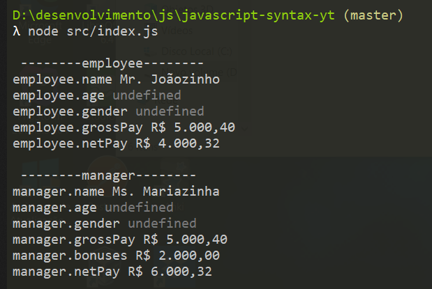

  <a href="#rocket-tecnologias">Tecnologias</a>&nbsp;&nbsp;&nbsp;|&nbsp;&nbsp;&nbsp;
  <a href="#-projeto">Projeto</a>&nbsp;&nbsp;&nbsp;|&nbsp;&nbsp;&nbsp;
  <a href="#-como-rodar">Como rodar</a>&nbsp;&nbsp;&nbsp;|&nbsp;&nbsp;&nbsp;
  <a href="#-como-contribuir">Como contribuir</a>&nbsp;&nbsp;&nbsp;
  

 

# Os segredos da Sintaxe Javascript - Pré #SemanaJSExpert

## 🚀 Tecnologias

Esse projeto foi desenvolvido com as seguintes tecnologias:

- [JavaScript](https://developer.mozilla.org/pt-BR/docs/Web/JavaScript) 
- [NodeJS](https://nodejs.org/en/) 
- [Yarn](https://yarnpkg.com/) 
- [NPM](https://www.npmjs.com/) 

## 💻 Projeto

Treinando os conceitos da sintaxe do JavaScript.

Canal [Erick Wendel](https://www.youtube.com/watch?v=DiqLe0nDekA)

Código fonte original [aqui](https://github.com/ErickWendel/javascript-syntax-yt)

Testes:

  

## 🚀 Como Rodar

- Clone o projeto.
- Entre na pasta do projeto e rode npm install.
- "node src/index.js".

## 🤔 Como contribuir

- Faça um fork desse repositório;
- Cria uma branch com a sua feature: `git checkout -b minha-feature`;
- Faça commit das suas alterações: `git commit -m 'feat: Minha nova feature'`;
- Faça push para a sua branch: `git push origin minha-feature`.

Depois que o merge da sua pull request for feito, você pode deletar a sua branch.

## 📝 Licença

Esse projeto está sob a licença MIT.
